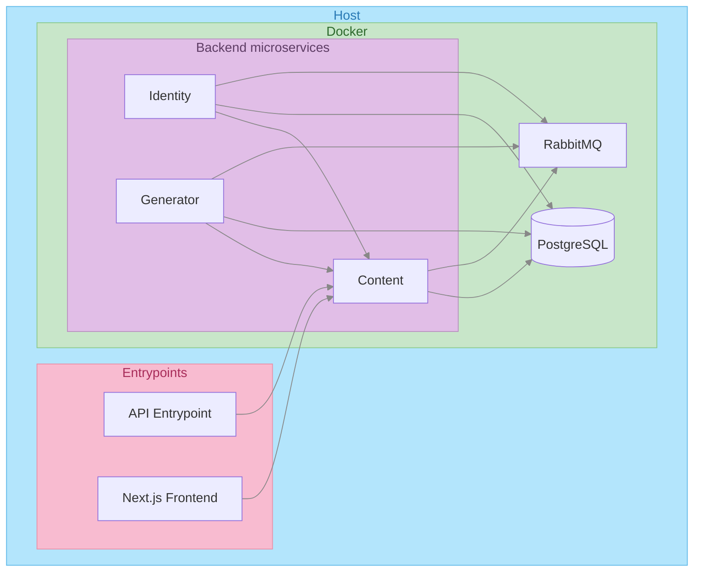

# ADR 0001: Docker, Go, PostgreSQL

## Status

Accepted

## Context

We need a consistent, portable runtime for backend services and databases across development and production.

Also don't want **to pollute the host machine** with unnecessary software needed only for development so we will use Docker to isolate the services and the database and automate the setup.

For the backend we will use Go and Fiber and GORM for the database access, as the Go is one of the most popular languages for backend development and Fiber is a fast and easy to use web framework for Go and GORM is a mature ORM for PostgreSQL.

## Decision

- **Docker** — Containerize all services for isolation, reproducibility, and deployment.
- **Go** — Backend language for services (performance, single binary, strong concurrency).
- **PostgreSQL** — Primary relational database for both frontend and backend data.
- **RabbitMQ** — Message broker for async communication between services.

## Consequences

- Consistent dev/prod parity
- Docker is used to isolate the services and the database and prevent the services from accessing the host machine and the database from accessing the host machine.
- Single-binary Go services simplify deployment
- Release containers are built on CI/CD pipeline and stored in the GitHub Container Registry (GHCR) to reduce the final deployment cost.
- PostgreSQL provides RLS, JSON support, and mature tooling. It's one of the fastest and most popular databases for backend development.
- RabbitMQ enables decoupled, async workflows (e.g. background jobs, event-driven flows) without blocking HTTP requests.

## Diagram

