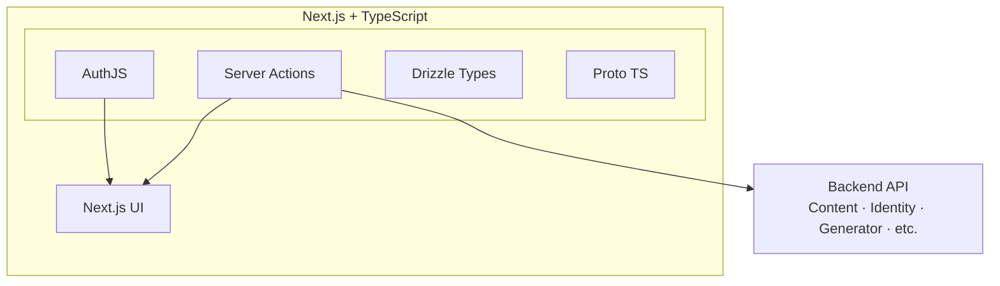

# ADR 0002: Next.js + Strong TypeScript

## Status

Accepted

## Context

We need a modern frontend framework with good DX, SEO, and type safety for the Quizdo GUI.

## Decision

- **Next.js** — React framework with SSR, App Router, API routes, server actions.
- **Strong TypeScript** — Strict mode, no `any` etc. We will use types from Proto (buf) and Drizzle.
- **AuthJS** — Authentication (OAuth, credentials) with Drizzle adapter for session/user storage.
- Backend API will use **AuthJS sessions** to authenticate requests using the same DB and JWT tokens.

## Consequences

- Type-safe API contracts and DB schema
- Server actions for backend calls without separate API layer
- AuthJS handles sign-in, sessions, and JWT for backend auth
- Good SEO and performance for public pages

## Diagram

