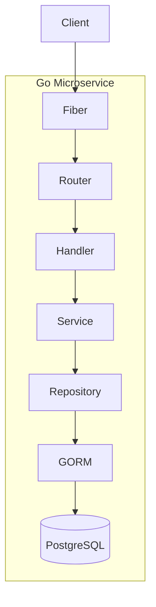

# ADR 0004: GORM + Fiber three layer architecture

## Status

Accepted

## Context

We need a Go backend stack for HTTP APIs and database access with good ergonomics. We will use GORM for the database access and Fiber for the HTTP API.

## Decision

- **GORM** — ORM for PostgreSQL; migrations, models, relations, callbacks.
- **Fiber** — HTTP framework; fast, Express-like API, middleware (JWT, CORS).

## Consequences

- Familiar patterns for Go web dev
- GORM handles migrations and RLS session vars via callbacks
- Fiber integrates well with JWT middleware for auth

## Diagram

