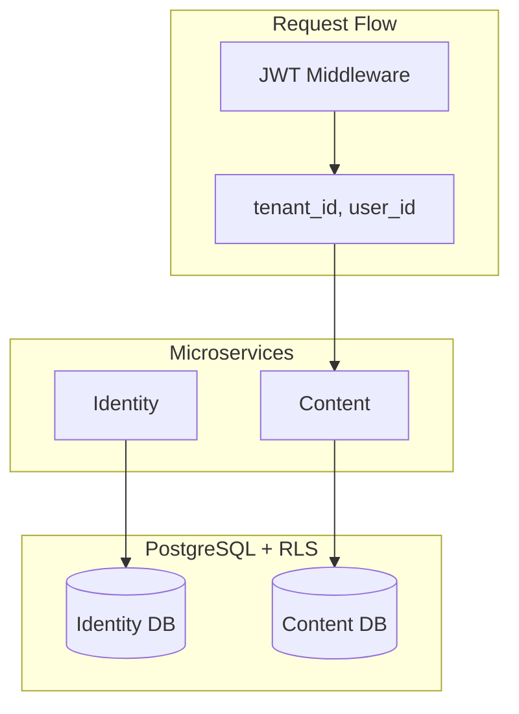

# ADR 0005: RLS + Microservice Architecture

## Status

Accepted

## Context

We need multi-tenant isolation and scalable backend services. Data must be isolated by tenant/user at the database level.

## Decision

- **Row Level Security (RLS)** — PostgreSQL policies filter rows by `tenant_id` / `author_id` from session vars.
- **Microservice architecture** — Separate services (Identity, Content, Generator, Collector, Evaluator) with per-service DBs.

## Consequences

- Defense in depth: data isolation at DB level.
- Services can scale independently.
- JWT middleware sets `app.current_tenant` / `app.current_user_id` before queries.

## Diagram

