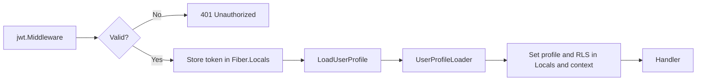

# ADR 0006: JWT Verification and User Profile Middleware

## Status

Accepted

## Context

Authenticate HTTP requests with JWTs and expose a verified user identity and profile to handlers. Verification must happen once; downstream code trusts the token in Locals.

## Decision

- **AuthJS** — Signs JWTs with RSA private key `jwt_private_key`; backends verify with matching public keys `jwt_pubkey_<service_name>` (Docker secrets stored key generated from `jwt_private_key` for each service).
- **JWT middleware** (`shared/jwt`) — Validates Bearer token with RSA public key (RS256), stores parsed token in `c.Locals(JWTContextKey)`. Invalid/missing token → 401.
- **Public key source** — `JWT_KEY_SECRET_NAME` is the name of the Docker secret containing the key for certain service. **Some services dont need JWT protection (e.g. GRPC services)**.
- **No decryption** — JWTs are signed; the public key verifies authenticity. The IDs are UUID so its safe to use it in JWT payload.
- **User profile middleware** (`shared/middleware.LoadUserProfile`) — Runs after JWT. Reads token, extracts `sub` and `tenant_id`, calls `UserProfileLoader` (calls identity service if needed), sets profile and RLS keys in context.
- **UserProfileLoader** — `LoadProfileFromClaims` (from JWT claims only) or `LoadProfileFromIdentity` (gRPC Identity service).

## Consequences

Single verification point; clear split between auth and profile loading; profile from claims or Identity by swapping the loader.

## Workflow

