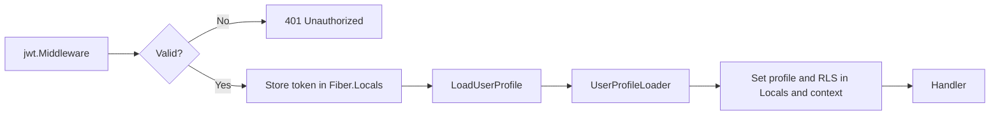

# ADR 0006: JWT Verification and User Profile Middleware

## Status

Accepted

## Context

Authenticate HTTP requests with JWTs and expose a verified user identity and profile to handlers. Verification must happen once; downstream code trusts the token in Locals.

## Decision

- **AuthJS** — Signs JWTs with an RSA private key from which the public keys for single services are derived; the public keys will be stored in Docker secrets and mounted at runtime (e.g. `cnt_pub_key`).
- **JWT middleware** (`shared/jwt`) — Validates Bearer token with RSA public key (RS256), stores parsed token in `c.Locals(JWTContextKey)`. Invalid/missing token → 401.
- **Public key source** — In Docker, each service that verifies JWTs gets its own public key file via Docker secrets (e.g. Content gets `cnt_pub_key`). Config reads from `JWT_PUBLIC_KEY_FILE` (e.g. `/run/secrets/cnt_pub_key`); see [ADR 0007: Docker Secrets and RSA Key Pair for JWT](0007-docker-secrets-rsa-jwt.md).
- **No decryption** — JWTs are signed; the public key verifies authenticity. The IDs are UUID so its safe to use it in JWT payload.
- **User profile middleware** (`shared/middleware.LoadUserProfile`) — Runs after JWT. Reads token, extracts `sub` and `tenant_id`, calls `UserProfileLoader` (calls identity service if needed), sets profile and RLS keys in context.
- **UserProfileLoader** — `LoadProfileFromClaims` (from JWT claims only) or `LoadProfileFromIdentity` (gRPC Identity service).

## Consequences

Single verification point; clear split between auth and profile loading; profile from claims or Identity by swapping the loader.

## Workflow

